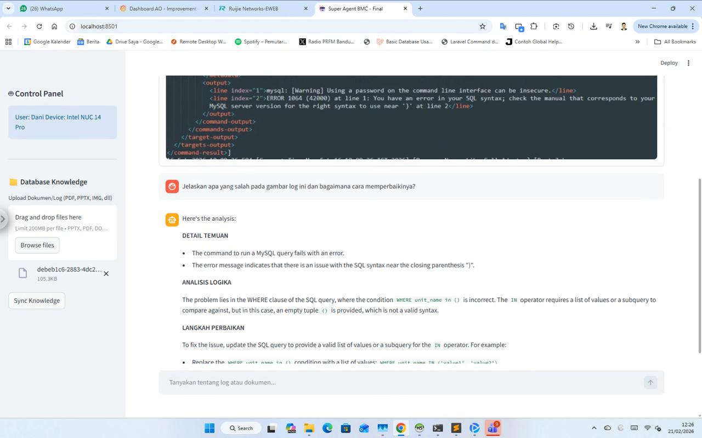

# 🤖 Super Agent BMC: Local RAG with OCR & Vision
**Developed by: [danifeb94](https://github.com/danifeb94)**

Asisten AI cerdas berbasis lokal yang berjalan di **Intel NUC 14 Pro**, dirancang untuk membantu analisis log sistem dan dokumentasi teknis secara otomatis dan private.

## 📺 Preview Dashboard

*Tampilan antarmuka Super Agent BMC saat menganalisis log error MySQL.*

## 🚀 Fitur Utama
- **Hybrid OCR + LLM**: Ekstraksi teks log dari screenshot menggunakan Tesseract OCR untuk menghindari halusinasi model Vision.
- **Multi-Format Ingestion**: Mendukung PDF, PPTX, XLSX, DOCX, dan TXT.
- **Automated RCA Report**: Ekspor hasil analisis langsung ke PDF standar industri.
- **Offline & Private**: 100% data lokal menggunakan Ollama (Llama 3).


## 🛠️ Cara Instalasi
1. Clone repository ini.
2. Pastikan Tesseract OCR terinstal di sistem Anda.
3. Buat virtual environment dan instal dependensi:
   ```powershell
   pip install -r requirements.txt
   ```
4. Jalankan aplikasi
   ```powershell
   streamlit run app.py
   ```   